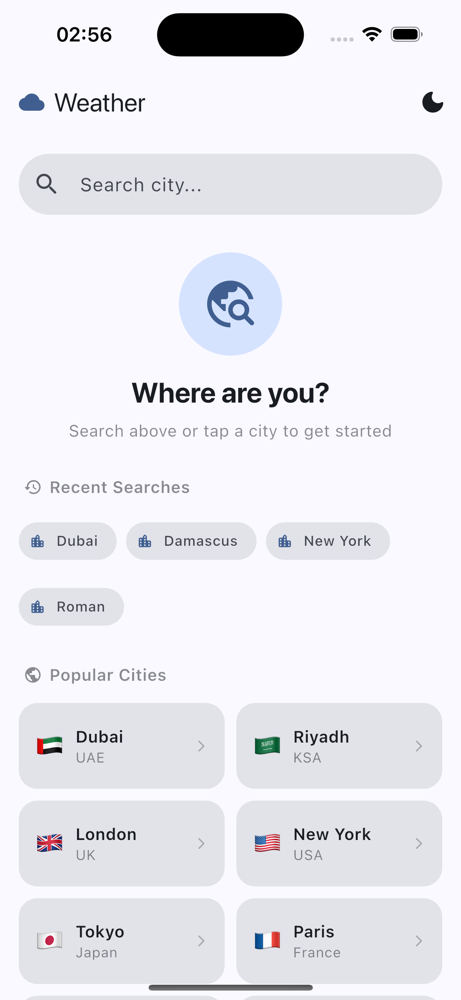
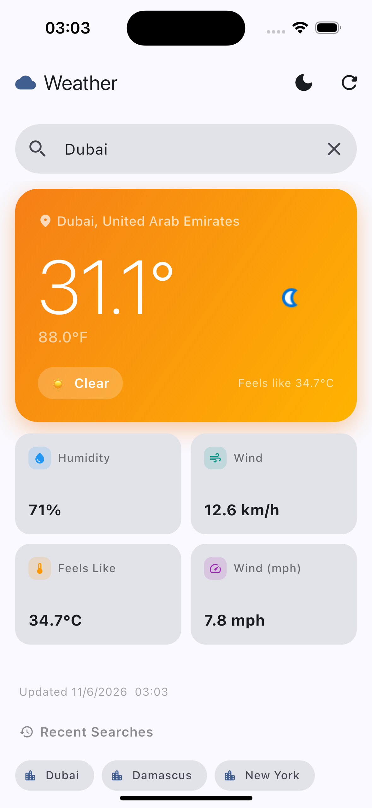
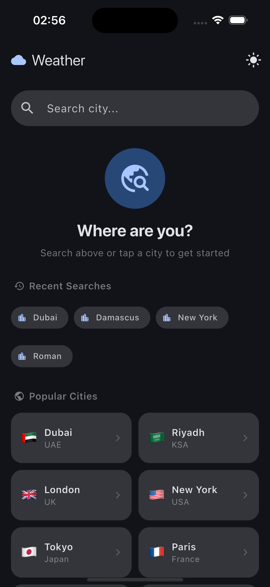
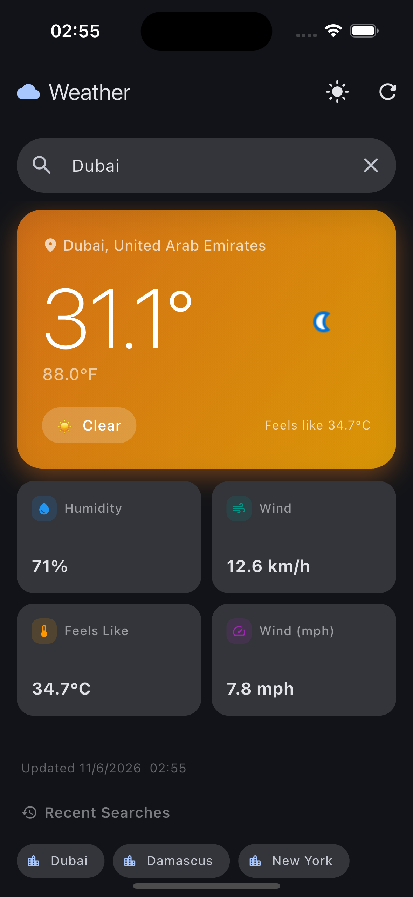

# 🌤️ Weather App — Flutter Technical Assessment

A production-ready Flutter application that allows users to search weather information by city name, view current weather details, maintain recent searches, and access the last viewed weather data while offline.

---

## 📋 Table of Contents

- [Screenshots](#-screenshots)
- [Demo Video](#-demo-video)
- [APK Download](#-apk-download)
- [Features](#-features)
- [Tech Stack & Packages](#-tech-stack--packages)
- [Architecture](#-architecture)
- [Folder Structure](#-folder-structure)
- [Setup Instructions](#-setup-instructions)
- [Offline Caching](#-offline-caching-explanation)
- [Error Handling Strategy](#-error-handling-strategy)
- [State Management Flow](#-state-management-flow)
- [Running Tests](#-running-tests)

---

## 📸 Screenshots

<table>
  <tr>
    <td align="center"><b>Home / Search</b></td>
    <td align="center"><b>Weather Result</b></td>
    <td align="center"><b>Recent Searches</b></td>
    <td align="center"><b>Offline / Dark Mode</b></td>
  </tr>
  <tr>
    <td></td>
    <td></td>
    <td></td>
    <td></td>
  </tr>
</table>

---

## 🎥 Demo Video

https://drive.google.com/file/d/1mj_ph79-NMjUI9z32YCccFSWhblx0IhA/view

---

## 📦 APK Download

https://drive.google.com/file/d/1dQ9L8hm8QCh60verJFG2wDSNovkZkkTv/view

---

## ✨ Features

| Feature | Description |
|---|---|
| 🔍 **City Search** | Search weather by any city name with real-time API fetch |
| 🌡️ **Weather Details** | City, temperature (°C / °F), condition, humidity, wind speed, feels like |
| 📶 **Offline Cache** | Last fetched weather persisted via Hive; loads automatically when offline |
| 🕓 **Recent Searches** | Deduplicated list of last 10 searches; tap any to re-fetch |
| ⏳ **Shimmer Loading** | Skeleton shimmer UI displayed during every fetch |
| 🔄 **Pull to Refresh** | Swipe down on the weather card to force a fresh API call |
| 🌙 **Dark / Light Mode** | Full Material 3 theming with system-aware and manual toggle |
| ⚠️ **Error Handling** | Distinct messages for invalid city, network failure, rate limit, server errors |

---

## 🛠 Tech Stack & Packages

| Package | Version | Purpose |
|---|---|---|
| `flutter_bloc` | ^8.1.5 | State management via Cubit |
| `dio` | ^5.4.3+1 | HTTP client with interceptors |
| `hive` + `hive_flutter` | ^2.2.3 / ^1.1.0 | Local NoSQL storage for cache |
| `get_it` | ^7.6.7 | Service locator / dependency injection |
| `equatable` | ^2.0.5 | Value equality for states and entities |
| `internet_connection_checker_plus` | ^2.5.0 | Detect network availability |
| `shimmer` | ^3.0.0 | Skeleton loading animation |
| `cached_network_image` | ^3.3.1 | Efficient weather icon loading |
| `mocktail` | ^1.0.3 | Mocking in unit tests |
| `bloc_test` | ^9.1.7 | Cubit / Bloc testing utilities |

**Weather API:** [WeatherAPI.com](https://www.weatherapi.com) — free tier supports 1 million calls/month.

---

## 🏛 Architecture

This project follows **Clean Architecture** with a strict separation of concerns across three layers. Dependencies always point **inward** — outer layers depend on inner layers, never the reverse.

```
┌─────────────────────────────────────────────┐
│             Presentation Layer              │
│   WeatherCubit · WeatherPage · Widgets      │
│   Depends on: Domain (Use Cases only)       │
└────────────────────┬────────────────────────┘
                     │ calls
┌────────────────────▼────────────────────────┐
│               Domain Layer                  │
│   Entities · Repository Interface           │
│   Use Cases: GetWeather, GetCached,         │
│   GetRecentSearches, SaveRecentSearch       │
│   No dependencies on Flutter or packages    │
└────────────────────┬────────────────────────┘
                     │ implemented by
┌────────────────────▼────────────────────────┐
│                Data Layer                   │
│   WeatherModel · RemoteDataSource           │
│   LocalDataSource · RepositoryImpl          │
│   Depends on: Dio, Hive, Domain interfaces  │
└─────────────────────────────────────────────┘
```

### Layer Responsibilities

#### Domain Layer *(innermost — zero Flutter dependencies)*
- **Entities** — Pure Dart classes (`WeatherEntity`) that represent business objects. Immutable, Equatable.
- **Repository Interface** — Abstract contract (`WeatherRepository`) defining what operations exist. The domain layer owns this interface; the data layer fulfills it.
- **Use Cases** — Single-responsibility classes, one per action:
  - `GetWeatherUseCase` — fetch weather (remote or fallback to cache)
  - `GetCachedWeatherUseCase` — read last cached weather
  - `GetRecentSearchesUseCase` — retrieve stored search history
  - `SaveRecentSearchUseCase` — persist a city to history

#### Data Layer *(implements domain contracts)*
- **WeatherModel** — Extends `WeatherEntity`, adds `fromJson`, `toJson`, `fromCacheJson` factory constructors.
- **WeatherRemoteDataSource** — Calls WeatherAPI.com via Dio. Throws typed exceptions (`CityNotFoundException`, `NetworkException`, `RateLimitException`, `ServerException`).
- **WeatherLocalDataSource** — Reads/writes to Hive boxes. Handles deduplication of recent searches. Serialises models to JSON strings.
- **WeatherRepositoryImpl** — Orchestrates remote vs local: tries remote first, falls back to cache on connectivity failure, updates cache on successful fetch.

#### Presentation Layer *(Flutter UI + Bloc)*
- **WeatherCubit** — Holds `WeatherState`, calls use cases, emits `WeatherInitial`, `WeatherLoading`, `WeatherLoaded`, `WeatherError`. Guards against duplicate requests during loading.
- **WeatherPage** — Main screen, listens to Cubit, renders state-appropriate UI.
- **Widgets** — Small, focused, reusable: `WeatherSearchBar`, `WeatherCard`, `WeatherShimmer`, `OfflineBanner`.

#### Core
- **DI (`injection_container.dart`)** — GetIt service locator wired at startup in `main.dart`. All registrations are `LazySingleton` except `WeatherCubit` which is `Factory` (new instance per page navigation).
- **NetworkClient** — Dio instance with `_AppInterceptor` that converts HTTP status codes and Dio error types into typed `AppException` subclasses before they surface in the repository.
- **ConnectivityService** — Thin wrapper around `internet_connection_checker_plus` to allow easy mocking in tests.
- **Theme** — Material 3 `ThemeData` for both light and dark modes, with a manual toggle persisted across sessions.
- **WeatherConditionStyle** — Maps WeatherAPI condition text to a `MaterialIcon`, a gradient color pair, and an emoji. Keeps all visual condition logic in one place, out of the widget tree.
- **ThemeCubit** — Manages light/dark mode state. Persists the selected theme to Hive so the preference survives app restarts. Consumed by `MaterialApp` at the root.

---

## 📁 Folder Structure

```
lib/
├── core/
│   ├── constants/
│   │   └── app_constants.dart          # API key, Hive keys, UI constants
│   ├── di/
│   │   └── injection_container.dart    # GetIt wiring for all dependencies
│   ├── error/
│   │   ├── exceptions.dart             # Typed exceptions (data layer throws)
│   │   └── failures.dart              # Typed failures (domain/presentation)
│   ├── network/
│   │   ├── network_client.dart         # Dio + interceptor setup
│   │   └── connectivity_service.dart   # Internet status abstraction
│   └── theme/
│       ├── app_theme.dart              # Light + Dark Material 3 ThemeData
│       └── weather_condition_style.dart # Maps WeatherAPI condition → icon + gradient
│
├── data/
│   ├── datasources/
│   │   ├── weather_remote_datasource.dart   # Dio API calls
│   │   └── weather_local_datasource.dart    # Hive read/write
│   ├── models/
│   │   └── weather_model.dart               # JSON ↔ Entity bridge
│   └── repositories/
│       └── weather_repository_impl.dart     # Orchestrates remote + local
│
├── domain/
│   ├── entities/
│   │   └── weather_entity.dart         # Pure business object
│   ├── repositories/
│   │   └── weather_repository.dart     # Abstract interface
│   └── usecases/
│       ├── get_weather_usecase.dart
│       ├── get_cached_weather_usecase.dart
│       ├── get_recent_searches_usecase.dart
│       └── save_recent_search_usecase.dart
│
├── presentation/
│   ├── cubit/
│   │   ├── weather_cubit.dart          # Business logic + state transitions
│   │   ├── weather_state.dart          # Equatable state classes
│   │   └── theme_cubit.dart            # Light/Dark mode toggle + persistence
│   ├── pages/
│   │   └── weather_page.dart           # Main screen
│   └── widgets/
│       ├── weather_card.dart           # Full weather details card
│       ├── weather_search_bar.dart     # Search input with loading guard
│       ├── weather_shimmer.dart        # Skeleton loading UI
│       ├── offline_banner.dart         # Cached data warning banner
│       └── theme_toggle_button.dart    # Light/Dark mode switch button
│
└── main.dart                           # App entry point, Hive init, DI setup

test/
├── presentation/
│   └── cubit/
        └── weather_cubit_test.dart

assets/
├── screenshots/
│   ├── screenshot_1.png
│   ├── screenshot_2.png
│   ├── screenshot_3.png
│   └── screenshot_4.png
```

---

## 🚀 Setup Instructions

### Prerequisites

- Flutter SDK `3.35.x`
- Dart SDK `>=3.10.1 <4.0.0`
- A free API key from [WeatherAPI.com](https://www.weatherapi.com/signup.aspx)

### Step 1 — Clone the repository

```bash
git clone https://github.com/MoSallah21/Weather-App-with-Offline-Cache.git
cd Weather-App-with-Offline-Cache
```

### Step 2 — Add your API key

Open `lib/core/constants/app_constants.dart` and replace the placeholder:

```dart
// Before
static const String apiKey = 'YOUR_WEATHERAPI_KEY';

// After — paste your key from weatherapi.com/my
static const String apiKey = 'your_actual_key_here';
```

> ⚠️ **Never commit your real API key to version control.**

### Step 3 — Install dependencies

```bash
flutter pub get
```

### Step 4 — Run the app

```bash
flutter run
```

### Step 5 — Build APK

```bash
flutter build apk --release
# Output: build/app/outputs/flutter-apk/app-release.apk
```

### Step 6 — Run tests

```bash
flutter test
```

---

## 📶 Offline Caching Explanation

Offline support is implemented across two layers working together:

### How data flows

```
User searches "London"
        │
        ▼
WeatherRepositoryImpl.getWeather("London")
        │
        ├─── ConnectivityService.isConnected?
        │         │
        │    YES ─┼─▶ RemoteDataSource.getWeather("London")
        │         │         │
        │         │    Success ──▶ LocalDataSource.cacheWeather(model)
        │         │                     └──▶ return (weather, isFromCache: false)
        │         │
        │         │    NetworkException ──▶ LocalDataSource.getCachedWeather()
        │         │                              ├── cache exists ──▶ return (weather, isFromCache: true)
        │         │                              └── no cache ──▶ rethrow NetworkException
        │         │
        │    NO ──┼─▶ LocalDataSource.getCachedWeather()
        │                   ├── cache exists ──▶ return (weather, isFromCache: true)
        │                   └── no cache ──▶ throw NetworkException
        │
        ▼
WeatherCubit receives result
        ├── isFromCache: false ──▶ WeatherLoaded (no banner)
        └── isFromCache: true  ──▶ WeatherLoaded + OfflineBanner shown
```

### Storage format (Hive)

```
Box: "weatherBox"
  Key: "cachedWeather"
  Value: '{"cityName":"London","temperatureCelsius":18.5,...}'

Box: "recentSearchesBox"
  Key: "recentSearches"
  Value: '["London","Dubai","New York","Tokyo"]'
```

### Cache update policy

- Cache is **written on every successful API response**, including pull-to-refresh.
- Cache is **never overwritten by offline reads** — it always reflects the last known live data.
- `lastUpdated` timestamp is stored so the UI can display how stale the data is.

---

## 🔴 Error Handling Strategy

| Scenario | Exception Thrown | User-Facing Message |
|---|---|---|
| City not found (400/404) | `CityNotFoundException` | "City not found. Please check the city name." |
| No internet + cache exists | *(no exception)* | `WeatherLoaded` with `isFromCache: true` + banner |
| No internet + no cache | `NetworkException` | "No internet connection and no cached data available." |
| Server error (5xx) | `ServerException` | "Server error. Please try again later." |
| Rate limit (429) | `RateLimitException` | "API rate limit exceeded. Please try again later." |
| Unexpected error | `Exception` catch-all | "An unexpected error occurred. Please try again." |

---

## 🔄 State Management Flow

```
WeatherCubit
    │
    ├── init()
    │       └── emits WeatherInitial(recentSearches: [...])
    │
    ├── searchWeather(city)
    │       ├── Guard: if state is WeatherLoading → return immediately (no duplicate)
    │       ├── emits WeatherLoading
    │       ├── calls GetWeatherUseCase(city)
    │       │       ├── Success → saveRecentSearch → emits WeatherLoaded
    │       │       └── Failure → emits WeatherError(message)
    │       └── Always re-fetches recentSearches before final emit
    │
    ├── refresh()
    │       └── re-calls searchWeather(current city from state)
    │
    └── loadCachedWeather()
            └── emits WeatherLoaded(isFromCache: true) if cache exists
```

---

## 🧪 Running Tests

```bash
# Run all tests
flutter test

# Run with coverage
flutter test --coverage
```
